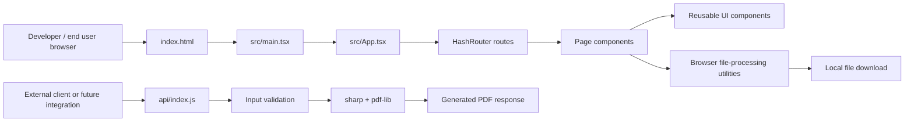

# YourPDF

YourPDF is a browser-first file conversion platform built with React, Vite, Tailwind CSS, and a small Express API for image-to-PDF conversion. The frontend is a HashRouter-based single-page app with a landing page, tool pages, company/legal pages, and a developer API page.

## Features

- Client-side PDF tools for merge, split, compress, rotate, watermark, page numbering, and image-to-PDF.
- Client-side image tools for compression, resize, crop, PNG to JPG, and PDF-to-image conversion.
- Client-side document and data conversion helpers for common office formats.
- AI-oriented browser utilities for PDF summarization, PDF search/chat, and OCR.
- A small Express API for `/health` and `POST /convert/images-to-pdf`.
- Dark mode persisted in localStorage.
- Drag-and-drop file handling and per-tool validation.
- SEO assets such as `robots.txt`, `sitemap.xml`, and a Google verification file.
- Separate Dockerfiles for the frontend and API.

## Architecture Overview

The application is split into two runtime surfaces:

- The frontend is a Vite-built React SPA that handles routing, UI, and most file processing directly in the browser.
- The API is a separate Express service that only implements image-to-PDF conversion and a health check.



Design decisions that matter:

- Hash routing is used so the app can be hosted on static infrastructure without server rewrite rules.
- Most tool processing happens locally in the browser, which keeps files on the device and avoids a database.
- `vite-plugin-singlefile` is enabled so the frontend can be built into a single deployable static bundle.
- The public API surface is intentionally small; the current backend only serves the implemented image-to-PDF workflow.

## Tech Stack

- Frontend: React 19, TypeScript, Vite, Tailwind CSS, Framer Motion, React Router.
- File processing: `pdf-lib`, `pdfjs-dist`, `html2canvas`, `jspdf`, `docx`, `mammoth`, `xlsx`, `tesseract.js`, `@ffmpeg/ffmpeg`.
- Server: Node.js, Express, Multer, Sharp, Helmet, CORS.
- Build and packaging: Vite, `vite-plugin-singlefile`, Docker.

## Project Structure

```text
.
├── api/
│   ├── index.js            # Express API entry point
│   ├── package.json        # API scripts and dependencies
│   └── Dockerfile          # API container image
├── src/
│   ├── App.tsx             # Root router, shell, and dark-mode state
│   ├── main.tsx            # React entry point
│   ├── index.css           # Global styles and theme tokens
│   ├── components/         # Shared UI sections and layout pieces
│   ├── data/               # Tool catalog, category data, FAQ/testimonial content
│   ├── pages/              # Routed pages and tool workspace
│   └── utils/              # Browser-side file processing helpers
├── index.html              # Vite HTML shell and SEO metadata
├── vite.config.ts          # Vite config, aliasing, and single-file build plugin
├── tsconfig.json           # TypeScript compiler options and path aliases
├── Dockerfile              # Frontend production image
├── .env.example            # Example environment variables
├── test-merge.mjs          # Ad hoc PDF merge validation script
├── robots.txt              # SEO robots file
├── sitemap.xml             # SEO sitemap
└── google-site-verification.html
```

Major directories:

- `src/components/`: reusable sections such as the header, footer, hero, FAQ, pricing, testimonials, and tool grid.
- `src/pages/`: routed screens, including the homepage, `/tools/:toolId`, company pages, policy pages, and the frontend API docs page.
- `src/utils/`: the real conversion logic for PDFs, images, documents, data files, OCR, and media helpers.
- `api/`: the separate Express backend used for server-side image-to-PDF conversion.

## Prerequisites

- Node.js 18 or newer. Both Dockerfiles use Node 18 as the base image.
- npm.
- A modern browser with JavaScript, drag-and-drop file support, and File/Blob APIs.

No database is required.

## Installation

Install the frontend dependencies from the repository root:

```bash
npm ci
```

Install the API dependencies separately:

```bash
cd api
npm ci
```

If you prefer editable installs during local development, `npm install` also works in both locations.

## Configuration

### Environment Variables

Create local environment files from `.env.example` and the API process environment as needed.

| Variable | Scope | Default / Example | Description |
| --- | --- | --- | --- |
| `VITE_API_URL` | Frontend | `http://localhost:3000/api` | Base URL referenced by the frontend API docs page. No automatic frontend API client was detected. |
| `NODE_ENV` | Frontend example | `development` | Used by browser-side helpers to gate development-only behavior. |
| `VITE_MAX_FILE_SIZE` | Frontend | `104857600` | Browser-side file size limit used by `src/utils/securityUtils.ts` before upload or processing. |
| `VITE_CSP_ENABLED` | Frontend example only | commented out | Present only as an example in `.env.example`; no current code path consumes it. |
| `VITE_SENTRY_DSN` | Frontend example only | commented out | Present only as an example in `.env.example`; no current code path consumes it. |
| `VITE_GA_ID` | Frontend example only | commented out | Present only as an example in `.env.example`; no current code path consumes it. |
| `PORT` | API | `3001` | Port used by `api/index.js` when starting the Express server. |
| `MAX_FILE_SIZE` | API | `104857600` | Backend upload size limit used by `api/index.js`. |

### Configuration Files

- `.env.example`: sample frontend environment values and comments.
- `vite.config.ts`: Vite aliasing (`@ -> src`) and the single-file build plugin.
- `tsconfig.json`: strict TypeScript settings, `@/*` path alias, and `noUnusedLocals` / `noUnusedParameters` checks.
- `index.html`: SEO metadata, Open Graph tags, a Google verification placeholder, and the root script entry.
- `Dockerfile`: production frontend container.
- `api/Dockerfile`: production API container.

## Running the Project

### Development

Start the frontend:

```bash
npm run dev
```

Start the API in a separate terminal:

```bash
cd api
npm start
```

The frontend uses `HashRouter`, so the app works on static hosts without server-side route rewrites.

### Production

Build the frontend:

```bash
npm run build
```

Preview the production build locally:

```bash
npm run preview
```

Run the API in production mode:

```bash
cd api
npm start
```

## Available Scripts / Commands

Frontend scripts from the root `package.json`:

| Command | Description |
| --- | --- |
| `npm run dev` | Start the Vite development server. |
| `npm run build` | Build the frontend for production. |
| `npm run preview` | Preview the production frontend build. |

API scripts from `api/package.json`:

| Command | Description |
| --- | --- |
| `npm start` | Start the Express API (`node index.js`). |

Other repository commands:

```bash
node test-merge.mjs
```

This ad hoc script generates `sample-a.pdf`, `sample-b.pdf`, and `merged-test.pdf` in the repository root.

## API Documentation

The current backend implementation is small and concrete. The frontend `/api` page also displays a future-facing documentation mockup with `/v1/...` routes, but those endpoints are not detected in the current server codebase.

### Endpoints

#### `GET /health`

Returns a basic health response.

Example request:

```bash
curl http://localhost:3001/health
```

Example response:

```json
{ "status": "ok" }
```

#### `POST /convert/images-to-pdf`

Converts up to 50 uploaded images into a single PDF.

Accepted file types:

- `image/jpeg`
- `image/png`
- `image/webp`
- `image/tiff`

Request format:

- `multipart/form-data`
- Field name: `images`

Example request:

```bash
curl -X POST http://localhost:3001/convert/images-to-pdf \
  -F "images=@./image-a.jpg" \
  -F "images=@./image-b.png" \
  --output images-to-pdf.pdf
```

Example success behavior:

- Response type: `application/pdf`
- Content-Disposition: attachment with a generated filename
- Body: raw PDF bytes

Example error response:

```json
{ "error": "No files uploaded" }
```

### Authentication

Not detected in the current codebase. The API currently uses open CORS and does not implement authentication or API keys.

### Request / Response Notes

- The API validates file count, MIME type, and size before processing.
- WebP and TIFF inputs are converted to PNG internally when needed.
- Generated PDFs are also written to disk temporarily and scheduled for cleanup after 24 hours.

## Database

Not detected in the current codebase.

No database client, schema, migrations, or seeding flow was found.

## Testing

Not detected in the current codebase as an automated test suite.

The repository does include one ad hoc validation script:

```bash
node test-merge.mjs
```

That script is useful for verifying PDF merge behavior, but it is not a formal test runner.

## Code Quality

### Linting

Not detected in the current codebase. No ESLint configuration or lint script was found.

### Formatting

Not detected in the current codebase. No Prettier configuration or format script was found.

TypeScript strictness is enabled in `tsconfig.json`, including `noUnusedLocals`, `noUnusedParameters`, and `noFallthroughCasesInSwitch`.

## Deployment

The frontend can be deployed as static output from `npm run build`.

Because the app uses `HashRouter`, static hosting does not need custom rewrite rules for client-side routes.

The API must be deployed separately on a Node.js runtime or container because it is a standalone Express service.

## Docker / Docker Compose

### Frontend Dockerfile

The root [`Dockerfile`](Dockerfile) performs a multi-stage build:

- installs dependencies with `npm ci`
- runs `npm run build`
- serves `dist/` with `http-server` on port `3000`

Build and run it with:

```bash
docker build -t yourpdf-web .
docker run --rm -p 3000:3000 yourpdf-web
```

### API Dockerfile

The API [`api/Dockerfile`](api/Dockerfile) uses `node:18-alpine`, installs production dependencies, and starts `index.js` on port `3001`.

Build and run it with:

```bash
docker build -t yourpdf-api ./api
docker run --rm -p 3001:3001 yourpdf-api
```

### Docker Compose

Not detected in the current codebase.

## CI/CD

Not detected in the current codebase.

No GitHub Actions, pipeline config, or other CI workflow files were found.

## Logging & Monitoring

Not detected in the current codebase as a dedicated observability setup.

Observed behavior:

- The API logs startup and error information with `console.log` / `console.error`.
- `src/utils/securityUtils.ts` suppresses error logging in production paths.
- `src/utils/mediaTools.ts` only emits FFmpeg debug logs in development mode.

## Security Considerations

- Browser-side processing keeps most file contents on the user device.
- `src/utils/securityUtils.ts` validates file size, MIME type, extensions, filenames, JSON parsing, and URLs.
- The API uses `helmet()` and `cors()`.
- The API limits image uploads to 50 files per request and enforces size/type validation.
- Generated API output files are cleaned up after a 24-hour delay.
- No authentication or authorization layer was detected.

## Performance Notes

- Large files can be slow because most conversions happen in the browser.
- OCR and video-related helpers are heavier than simple PDF/image operations.
- FFmpeg is loaded on demand from a CDN inside `src/utils/mediaTools.ts`.
- The single-file frontend build is meant to simplify static deployment.

## Troubleshooting

- If `npm run dev` or `npm run build` fails, confirm that you installed dependencies in the repository root.
- If the API does not start, confirm that you also installed dependencies inside `api/`.
- If uploads are rejected, check the file type and size against the limits in `.env.example` and `api/index.js`.
- If a route appears broken on static hosting, make sure you are opening the hash-based URL generated by the app, not a server rewrite path.
- If a tool is marked as coming soon, that is expected for several entries in `src/data/tools.ts`.

## Contributing Guidelines

Repository-specific contribution guidelines were not detected in the current codebase.

If you are extending the project, keep changes aligned with the browser-first architecture and verify the affected command paths before opening a pull request.

## License

Not detected in the current codebase.

## Acknowledgements

Not detected in the current codebase.

The project relies on open-source packages including React, Vite, Tailwind CSS, pdf-lib, Sharp, FFmpeg, Tesseract.js, and Express.